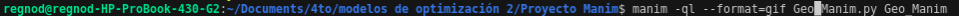
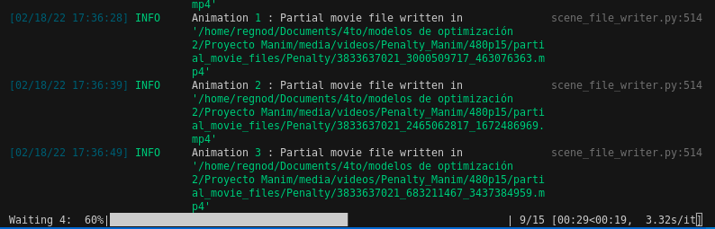
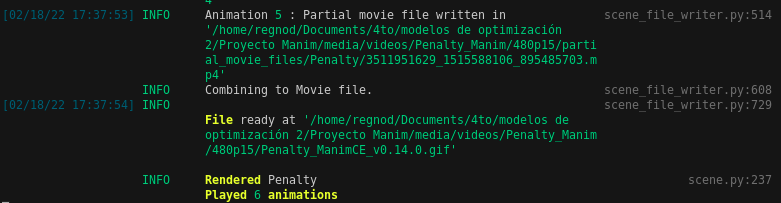
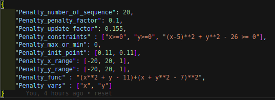
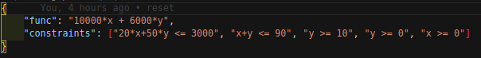
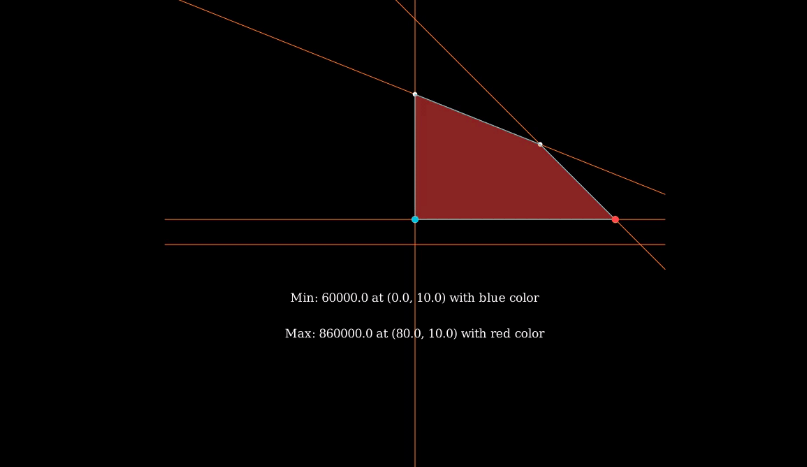
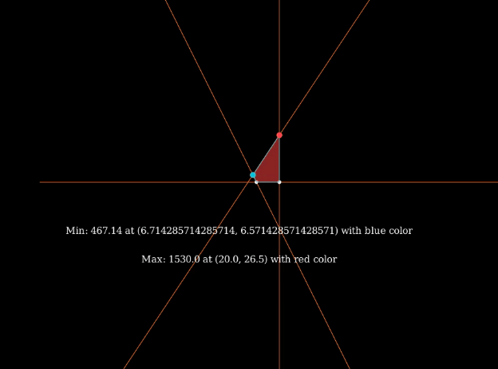
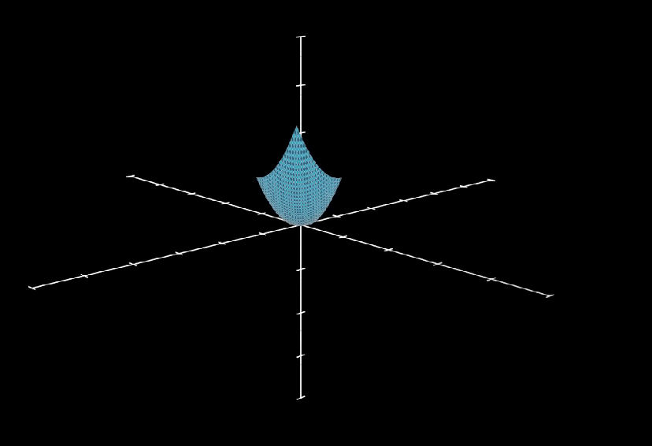
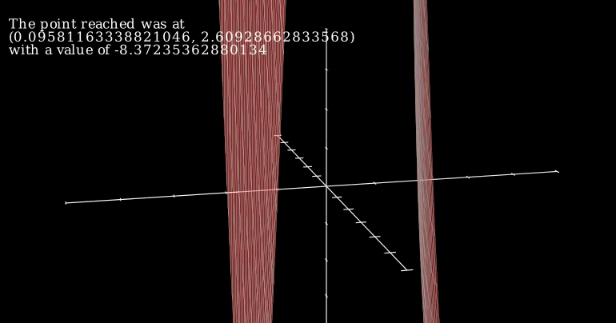

### Informe para el usuario:

Este sería un ejemplo de como ejecutar el programa, el flag __-ql__ es para la calidad, la __l__ significa low, existen otros como __m__, __h__, __k__ los cuales corresponden a medium, high y 4k respectivamente. Se debe tener cuidado al usar estos por el consumo de CPU. También podemos añadirle __-p__ al flag anterior quedando __-pql__ para que al terminar de ejecutar el programa muestre el resultado en un video. Los demás parametros deben ser el nombre del .py a ejecutar y el nombre de la clase que implementa las clases de Manim. El flag --format=gif es usado para que el archivo que retorne sea en formato gif y no un video.

Un ejemplo del proceso del programa.

Cuando llegue aqui ya terminó el proceso y muestra el path donde se encuentra el archivo.

Esta sería la configuración del __penalty_settings.json__ la cual consiste en 2 objetos, el primer string corresponde a la funcion objetivo y el segundo es una lista con las restricciones descritas a través de strings. Los otros parametros son más especificos del método de penalización, la cantidad de iteraciones como caso de parada, el coeficiente de penalización, el valor para aumentar este, los rangos de x y las y.

Esta sería la configuración del __geometric_aproach.json__ la cual consiste en 2 objetos, el primer string corresponde a la funcion objetivo y el segundo es una lista con las restricciones descritas a través de strings.  

A continuación tenemos ejemplos de lo realizado.

Aquí podemos observar como sería el resultado de graficar una función con esta erramienta en 3d.

