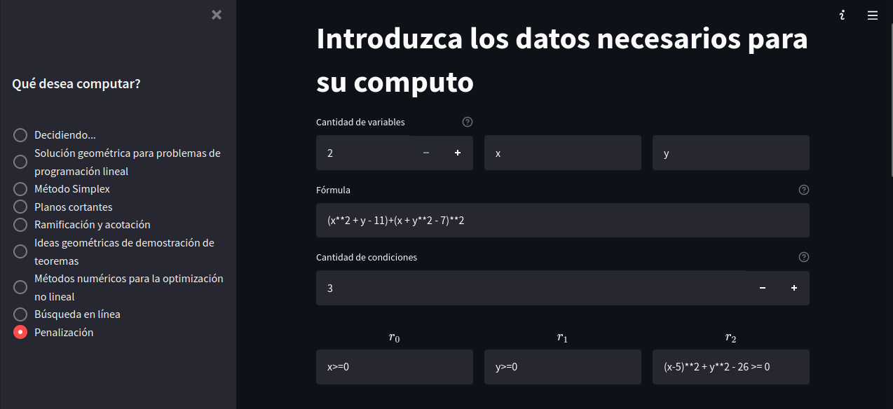

### Informe para el usuario:

Para iniciar la aplicación debe ejecutar la siguiente linea de codigo en una consola

Este sería el menú principal de nuestra aplicación. En este damos a conocer los datos de los integrantes del equipo y del proyecto en general, así como las opciones del programa a la izquierda. 

A continuación mostramos un ejemplo predeterminado para el problema de la solución geométrica. De esta forma se puede apreciar la forma en que se llenan las casillas de los parámetros necesarios para ejecutar este. 

A continuación mostramos un ejemplo predeterminado para el problema de Penalización. De esta forma se puede apreciar la forma en que se llenan las casillas de los parámetros necesarios para ejecutarlo. 

Este sería un ejemplo de como ejecutar el programa en Manim, el flag **-ql** es para la calidad, la **l** significa low, existen otros como **m**, **h**, **k** los cuales corresponden a medium, high y 4k respectivamente. Se debe tener cuidado al usar estos por el consumo de CPU. También podemos añadirle **-p** al flag anterior quedando **-pql** para que al terminar de ejecutar el programa muestre el resultado en un video. Los demás parámetros deben ser el nombre del .py a ejecutar y el nombre de la clase que implementa las clases de Manim. El flag --format=gif es usado para que el archivo que retorne sea en formato gif y no un video.

Un ejemplo del proceso del programa.

Cuando llegue aquí ya terminó el proceso y muestra el path donde se encuentra el archivo.

Esta sería la configuración del **penalty_settings.json** la cual consiste en 2 objetos, el primer string corresponde a la función objetivo y el segundo es una lista con las restricciones descritas a través de strings. Los otros parámetros son más específicos del método de penalización, la cantidad de iteraciones como caso de parada, el coeficiente de penalización, el valor para aumentar este, los rangos de x y las y. Los valores del mismo se llenan a traves de la aplicación antes de ejecutar este algoritmo.

Esta sería la configuración del **geometric_aproach.json** la cual consiste en 2 objetos, el primer string corresponde a la función objetivo y el segundo es una lista con las restricciones descritas a través de strings. Los valores del mismo se llenan a traves de la aplicación antes de ejecutar este algoritmo al igual que el anterior.

A continuación tenemos ejemplos de lo realizado.

Aquí podemos observar como sería el resultado de graficar una función con esta herramienta en 3d.

### Ramificación y acotación:

Para realizar una animación del método de ramificación y acotación se debe definir un json con el nombre `bab.json` que posea la siguiente estructura:

    {
        "vars": vars,
        "func": func,
        "constraints": constraints,
        "initial_point": initial_point,
        "u_range": u_range,
        "v_range": v_range,
        "stroke_width": stroke_width
    }

- "vars" (list[string]): las diferentes variables que se encuentran en la función a minimizar
- "func" (string): la función que se desea minimizar
- "constraints" (list[string]): las diferentes restricciones que se desean agregar
- "initial_point" (list[float]): punto inicial que se tomará para la minimización de la función
- "u_range" ([float, float]): el intervalo que se generará en el gráfico en el eje x
- "v_range" ([float, float]): el intervalo que se generará en el gráfico en el eje y
- "stroke_width" (float): grosor de las líneas en el gráfico a generar

Podemos poner como ejemplo:

    {
        "vars": ["x", "y"],
        "func": "- (7 * x * y / 2.71828 ** ( x ** 2 + y ** 2))",
        "constraints": ["x >= -2", "y >= -2", "x <= 2", "y <= 2"],
        "initial_point": [1, 1],
        "u_range": [-5, 5],
        "v_range": [-5, 5],
        "stroke_width": 0.5
    }

Este json anterior nos daría como resultado una animación como se muestra en la siguiente imagen:

En cambio si lo modificamos para que posea una sola variable obtendremos algo como el siguiente ejemplo:

### Métodos numéricos para la optimización no lineal

Para realizar una animación del Método del gradiente, Método del gradiente conjugado y el Método de Newton se debe definir un json con el nombre `numerical_optimization.json` que posea la siguiente estructura:

    {
        "vars": vars,
        "func": func,
        "initial_point": initial_point,
        "u_range": u_range,
        "v_range": v_range,
        "stroke_width": stroke_width
        "cycles": cycles
    }

- "vars" (list[string]): las diferentes variables que se encuentran en la función a minimizar
- "func" (string): la función que se desea minimizar
- "initial_point" (list[float]): punto inicial que se tomará para la minimización de la función
- "u_range" ([float, float]): el intervalo que se generará en el gráfico en el eje x
- "v_range" ([float, float]): el intervalo que se generará en el gráfico en el eje y
- "stroke_width" (float): grosor de las líneas en el gráfico a generar
- "cycles" (int): cantidad de iteraciones máximas que se desean realizar para obtener una aproximación del mínimo valor.

Podemos poner como ejemplo:

    {
        "vars": ["x", "y"],
        "func": "- (7 _ x _ y / 2.71828 ** ( x ** 2 + y \*\* 2))",
        "constraints": ["x >= -2", "y >= -2", "x <= 2", "y <= 2"],
        "initial_point": [1, 1],
        "u_range": [-5, 5],
        "v_range": [-5, 5],
        "stroke_width": 0.5,
        "cycles": 500
    }

Este json anterior nos daría como resultado una animación como se muestra en la siguiente imagen:

En cambio si lo modificamos para que posea una sola variable obtendremos algo como el siguiente ejemplo:

## Planos cortantes

El archivo con los datos de entrada para el algoritmo de planos cortantes debe estar en /src/cutting_planes/model_cp.json. Este fichero se genera automáticamente con los valores especificados en el menú correspondiente de la página web.

Los datos necesarios son las variables con las que se trabajará, así como las restricciones y función a optimizar para dichas restricciones. También debe especificarse la matriz A, y los vectores b y c tal que el problema se exprese de la forma $\min cx ~~\text{s.a.}~Ax\leq b$.

Al acabar, con el botón **Computar** se mandará a ejecutar el algoritmo de minimización y el renderizado de la escena con manim. Una vez todo esto concluya(puede tomar varios segundos) se reproducirá el video resultante de graficar el problema con sus restricciones, eje de coordenadas, cortes generados, y el punto óptimo así como sus coordenadas.

## Búsqueda en la línea
El archivo con los datos de entrada para este método también es autogenerado con la información dada por el usuario en la aplicación web, y se encuentra en ./src/cutting_planes/model_cp.json.

Este otro método permite especificar parámetros para ajustar el ángulo de la cámara, pues en muchas escenas es probable que la cámara quede obstruida totalmente por la función graficada, en cuyo caso la imagen será un recuadro completo de color rojo. También se debe tener cuidado al especificar el rango de las **x** y de las **y** que se quiere representar. De no tenerse en consideración estos parámetros, es altamente probable que el video renderizado o no contenga la zona de interés para el problema, o se vea totalmente obstruida la cámara por la función a optimizar.

Una vez se esté seguro de la validez de los datos introducidos, con el botón computar se comenzará el algoritmo de optimización y posterior renderizado de la escena. Renderizar la escena en tres dimensiones puede tomar desde algunos segundos hasta varios minutos dependiendo de cuántas iteraciones se realizaron antes de llegar al óptimo, pues por cada iteración se agrega un nuevo punto a la escena.

Comenzaremos graficando la función objetivo, y gradualmente se agregarán los ejes de coordenadas, así como los puntos secuencialmente en el mismo orden en que son computados por las iteraciones. Además, debido a que en muchas ocasiones las funciones y los puntos serán difíciles de observar correctamente, la cámara girará alrededor de la escena lentamente según todo esto ocurre.

En color rojo, el punto inicial, especificado en los datos de entrada en /src/line_search/model_ls.json

En color azul, los puntos intermedios obtenidos, y finalmente en verde(parcialmente obstruido por otro punto azul en esta escena), el punto óptimo computado para la función, dadas las restricciones especificadas.