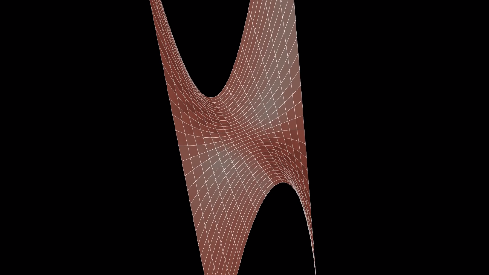

El archivo con los datos de entrada para el algoritmo de planos cortantes debe encontrarse estar en /src/cutting_planes/model_cp.json.

Para ejecutar el script principal con manim, ejecutar en este caso:

manim -p ./src/cutting_planes/gomory_cutting_planes.py Canvas

al acabar, se reproducirá el video resultante de graficar el problema con sus restricciones, eje de coordenadas, cortes generados, y el punto óptimo así como sus coordenadas.

De manera análoga para el algoritmo de búsqueda en la línea, se deberá hacer:

manim -p ./src/line_search/line_search.py ThreeDCanvas

Este otro método permite especificar parámetros para ajustar el ángulo de la cámara, pues en muchas escenas es probable que la cámara quede obstruida totalmente por la función graficada, en cuyo caso la imagen será un recuadro completo de color rojo. También se debe tener cuidado al especificar el rango de las **x** y de las **y** que se quiere representar. De no tenerse en consideración estos parámetros, es altamente probable que el video renderizado o no contenga la zona de interés para el problema, o se vea totalmente obstruida la cámara por la función a optimizar.

Comenzaremos graficando la función objetivo, y gradualmente se agregarán los ejes de coordenadas, así como los puntos secuencialmente en el mismo orden en que son computados por las iteraciones. Además, debido a que en muchas ocasiones las funciones y los puntos serán difíciles de observar correctamente, la cámara girará alrededor de la escena lentamente según todo esto ocurre.

En color rojo, el punto inicial, especificado en los datos de entrada en /src/line_search/model_ls.json

En color azul, los puntos intermedios obtenidos, y finalmente en verde(parcialmente obstruido por otro punto azul en esta escena), el punto óptimo computado para la función, dadas las restricciones especificadas.