# Manual de usuario

¡Bienvenido querido usuario! Esta aplicación fue desarrollada a partir de la biblioteca Manim de python. Su objetivo principal es permitir la visualización de conceptos y algoritmos relacionados con Modelos de Optimización

## Instalación y ejecución

La aplicación cuenta con una lista de requerimientos, a los que puede acceder desde el correspondiente archivo; o si lo prefiere puede ejecutar el siguiente comando en la terminal, en la raíz del proyecto:

```
make install
```

Una vez instaladas las dependencias necesarias, puede iniciar la aplicación en cualquier momento. Para ello deberá ejecutar la siguiente línea de código en una consola: `make` o `make run`. El primero de ellos se encarga de llamar al segundo, en cuanto a funcionalidad sería el mismo comando, así que no hay diferencia entre usar uno u otro. El resultado será una _url_ donde podrá ver su aplicación en el browser.

## Aplicación visual y cómo usarla

Lo primero que verá al abrir esta aplicación es la página de bienvenida donde se encuentran los datos de los desarrolladores y la descripción de la misma. Encontrará una barra lateral izquierda con un menú de opciones, donde cada opción representa una de las acciones que puede ejecutar en el programa. Esta página inicial es la siguiente:

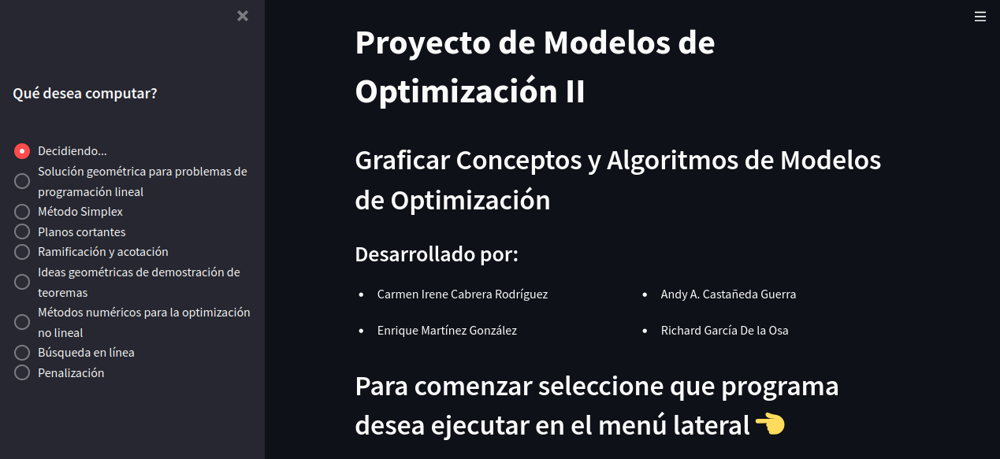

Puede notar que siempre que se encuentre en esta página estará marcada la opción "**Decidiendo ...**". Las otras opciones posibles son:

- Solución geométrica para problemas de programación lineal
- Método Simplex
- Planos cortantes
- Ramificación y acotación
- Ideas geométricas de demostración de teoremas
- Métodos numéricos para la optimización no lineal
- Búsqueda en línea
- Penalización

La idea principal es que dado un problema de optimización y la acción que usted desee realizar, marque la opción correspondiente y sea capaz de insertar los datos de su problema en la aplicación; de modo que esta se encargue de resolverla y hacer las graficaciones pertinentes. Para ello, seleccionar alguna de estas opciones dará lugar a un formulario donde usted podrá rellenar los campos requeridos para la resolución de su problema.

A continuación se mostrará un ejemplo predeterminado para cada opción anterior. De esta forma, podrá apreciar mejor la forma en que deberá completar los parámetros, se podrá ahondar en las especificaciones de cada una y será capaz de visualizar los resultados que se obtengan.

### Solución geométrica de problemas de programación lineal

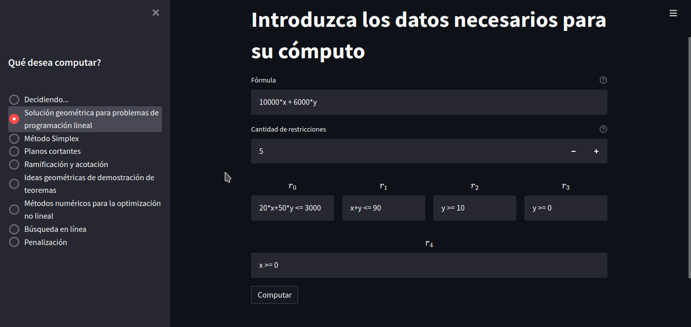

Como puede ver en la imagen previa, ya los campos fueron rellenados con un ejemplo. Los datos a completar serían:

- **Fórmula**: Función a optimizar. Es una expresión matemática, que soporta operadores como : +, -, \*, \*\*, \\, ^, &, ...
- **Cantidad de restricciones**: Las restricciones serían las condiciones a las que están sujetas las variables, estas son las que determinan el conjunto de puntos factibles del problema. Note que puede aumentar o disminuir la cantidad que se muestra y con ello, aparecerán o desaparecerán respectivamente algunas casillas con label _r<sub>i</sub>_
- **Casillas _r<sub>i</sub>_**: Se refiere a la restricción i-ésima. Si en algún caso deja alguna casilla vacía se asumirá que cuenta con una restricción menos, así que tenga cuidado a la hora de rellenarlas.

Luego de esto podrá marcar el botón **Computar**, que puede demorarse o no dependiendo de la cantidad de calculos a realizar. Una vez terminado el tiempo de espera obtendrá un resultado como el siguiente:

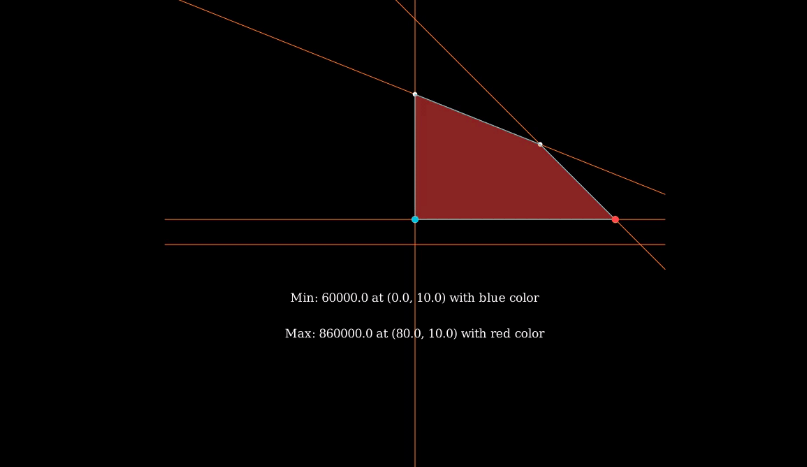

### Método Simplex

El problema que desee resolver utilizando el método Simplex, se puede modelar de la siguiente forma:

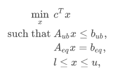

El formulario que muestra esta página será de la siguiente forma:

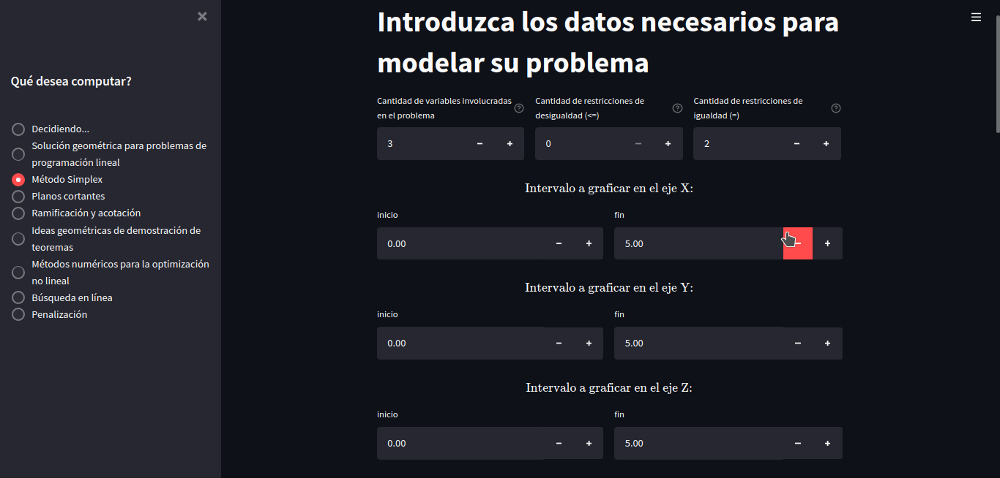
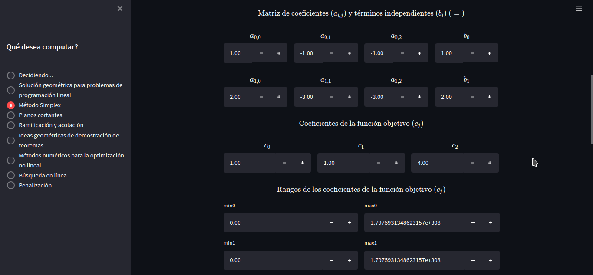

En este caso el modelo utilizado como ejemplo es el siguiente:

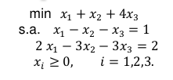

Primero deberá seleccionar la cantidad de variables que están involucradas en su problema, así como la cantidad de restricciones de desigualdad y de igualdad. En este caso son _3_, _0_, _2_ respectivamente.

Se le pide completar los intervalos a graficar para cada variable, lo que concierne al graficado que se realice a partir del cómputo y no al modelo en sí mismo.

Luego debe rellenar la matriz de coeficientes de las restricciones, así como los valores independientes de las mismas. En este caso particular no hay restricciones de desigualdad, por tanto solo deberá completar con los valores de _A<sub>eq</sub>_ y _b<sub>eq</sub>_. Tambié se requieren los valores de _c_, o sea, los coeficientes de la función objetivo.

Por último por cada variable deberá completar los límites de las mismas. Notará que por defecto aparecen unos valores ya en estas casillas, que serían el valor mínimo y máximo de número, representando el infinito en ambas direcciones. Por tanto si alguna variable no está limitada en alguna dirección podrá dejar la casilla tal cual aparece, como es el caso de este problema, donde solamente se conoce el límite inferior de cada variable, que es _0_ en cada caso.

Antes de ejecutar el programa de solución, se muestra una breve explicación de lo que obtendrá después del cómputo: _El archivo multimedia que se mostrará tras presionar el botón de Computar, representa la interpretación geométrica del área de puntos factibles del problema y de las soluciones factibles que genera Simplex en cada iteración. Dichas soluciones se mostrarán como puntos amarillos. En caso de obtener un óptimo del problema, el punto se mostrará rojo. Si el problema consta de solo 3 variables, también se realizará una graficación en 3D del mismo._

Los resultados serán de la siguente forma:

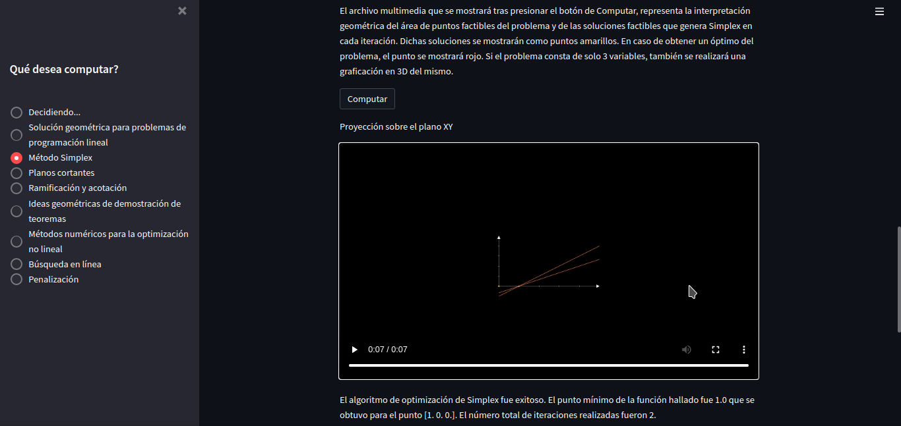
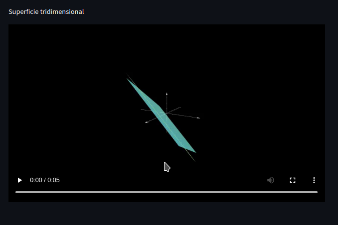

### Planos Cortantes

Los datos necesarios son las variables con las que se trabajará, así como las restricciones y función a optimizar para dichas restricciones. También debe especificarse la matriz _A_, y los vectores _b_ y _c_ tal que el problema se exprese de la forma $\min cx ~~\text{s.a.}~Ax\leq b$.

Al acabar, con el botón **Computar** se mandará a ejecutar el algoritmo de minimización y el renderizado de la escena con manim. Una vez todo esto concluya(puede tomar varios segundos) se reproducirá el video resultante de graficar el problema con sus restricciones, eje de coordenadas, cortes generados, y el punto óptimo así como sus coordenadas.

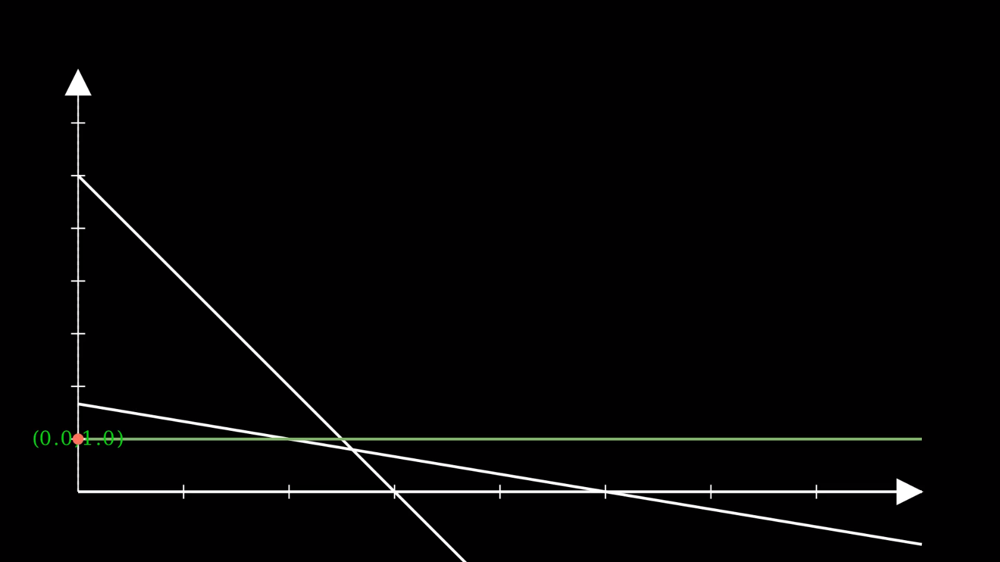

### Ramificación y acotación

Para realizar una animación del método de ramificación y acotación se debe definir un json con el nombre `bab.json` que posea la siguiente estructura:

    {
        "vars": vars,
        "func": func,
        "constraints": constraints,
        "initial_point": initial_point,
        "u_range": u_range,
        "v_range": v_range,
        "stroke_width": stroke_width
    }

- "vars" (list[string]): las diferentes variables que se encuentran en la función a minimizar
- "func" (string): la función que se desea minimizar
- "constraints" (list[string]): las diferentes restricciones que se desean agregar
- "initial_point" (list[float]): punto inicial que se tomará para la minimización de la función
- "u_range" ([float, float]): el intervalo que se generará en el gráfico en el eje x
- "v_range" ([float, float]): el intervalo que se generará en el gráfico en el eje y
- "stroke_width" (float): grosor de las líneas en el gráfico a generar

Podemos poner como ejemplo:

    {
        "vars": ["x", "y"],
        "func": "- (7 * x * y / 2.71828 ** ( x ** 2 + y ** 2))",
        "constraints": ["x >= -2", "y >= -2", "x <= 2", "y <= 2"],
        "initial_point": [1, 1],
        "u_range": [-5, 5],
        "v_range": [-5, 5],
        "stroke_width": 0.5
    }

Este json anterior nos daría como resultado una animación como se muestra en la siguiente imagen:

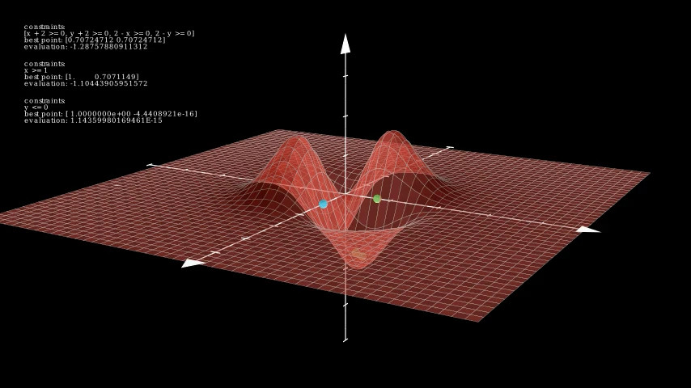

En cambio si lo modificamos para que posea una sola variable obtendremos algo como el siguiente ejemplo:

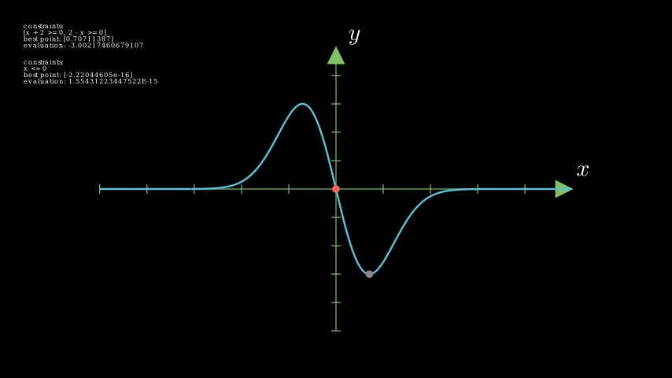

### Ideas geométricas para la demostración de teoremas

Esta página es diferente de las demás, en el sentido de que no será necesario que usted como usuario complete ninguna información. En la página aparece una lista con algún teorema o algoritmo, como se muestra en la siguiente figura:


Puede marcar el que desee (aunque en este momento solo se cuenta con el algoritmo Simplex) y aparecerá una descripción de la idea geométrica detrás del mismo, así como un ejemplo donde se puede evidenciar lo explicado.

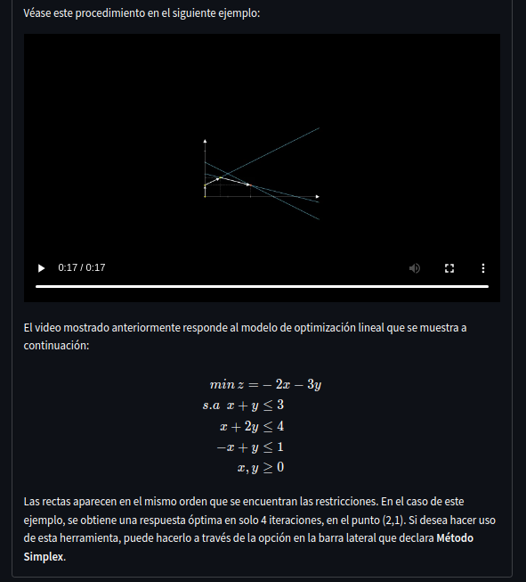

### Métodos numéricos para la optimización no lineal

Para realizar una animación del Método del gradiente, Método del gradiente conjugado y el Método de Newton se debe definir un json con el nombre `numerical_optimization.json` que posea la siguiente estructura:

    {
        "vars": vars,
        "func": func,
        "initial_point": initial_point,
        "u_range": u_range,
        "v_range": v_range,
        "stroke_width": stroke_width
        "cycles": cycles
    }

- "vars" (list[string]): las diferentes variables que se encuentran en la función a minimizar
- "func" (string): la función que se desea minimizar
- "initial_point" (list[float]): punto inicial que se tomará para la minimización de la función
- "u_range" ([float, float]): el intervalo que se generará en el gráfico en el eje x
- "v_range" ([float, float]): el intervalo que se generará en el gráfico en el eje y
- "stroke_width" (float): grosor de las líneas en el gráfico a generar
- "cycles" (int): cantidad de iteraciones máximas que se desean realizar para obtener una aproximación del mínimo valor.

Podemos poner como ejemplo:

    {
        "vars": ["x", "y"],
        "func": "- (7 _ x _ y / 2.71828 ** ( x ** 2 + y \*\* 2))",
        "constraints": ["x >= -2", "y >= -2", "x <= 2", "y <= 2"],
        "initial_point": [1, 1],
        "u_range": [-5, 5],
        "v_range": [-5, 5],
        "stroke_width": 0.5,
        "cycles": 500
    }

Este json anterior nos daría como resultado una animación como se muestra en la siguiente imagen:

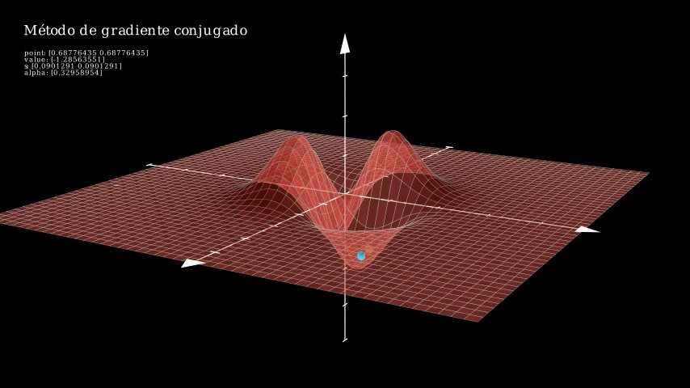

En cambio si lo modificamos para que posea una sola variable obtendremos algo como el siguiente ejemplo:

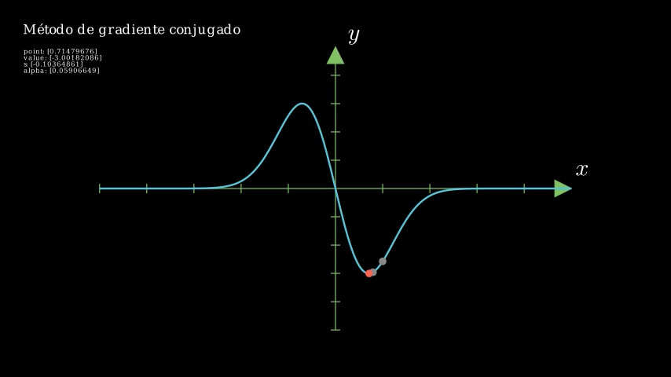

### Búsqueda en línea

Este método permite especificar parámetros para ajustar el ángulo de la cámara, pues en muchas escenas es probable que la cámara quede obstruida totalmente por la función graficada, en cuyo caso la imagen será un recuadro completo de color rojo. También se debe tener cuidado al especificar el rango de las **x** y de las **y** que se quiere representar. De no tenerse en consideración estos parámetros, es altamente probable que el video renderizado o no contenga la zona de interés para el problema, o se vea totalmente obstruida la cámara por la función a optimizar.

Una vez se esté seguro de la validez de los datos introducidos, con el botón computar se comenzará el algoritmo de optimización y posterior renderizado de la escena. Renderizar la escena en tres dimensiones puede tomar desde algunos segundos hasta varios minutos dependiendo de cuántas iteraciones se realizaron antes de llegar al óptimo, pues por cada iteración se agrega un nuevo punto a la escena.

Primeramente se plotea la función:

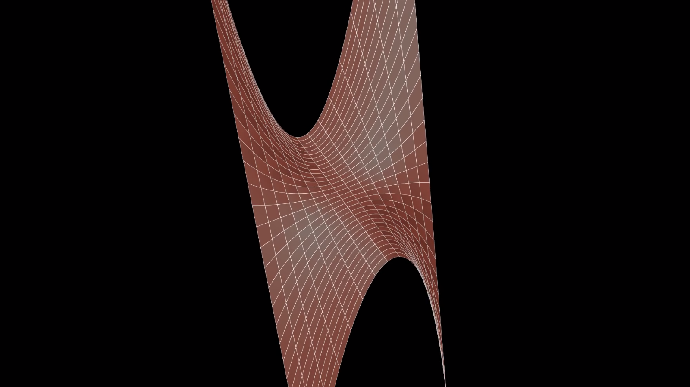

Se comienza graficando la función objetivo, y gradualmente se agregarán los ejes de coordenadas, así como los puntos, secuencialmente en el mismo orden en que son computados por las iteraciones. Además, debido a que en muchas ocasiones las funciones y los puntos serán difíciles de observar correctamente, la cámara girará alrededor de la escena lentamente según todo esto ocurre.

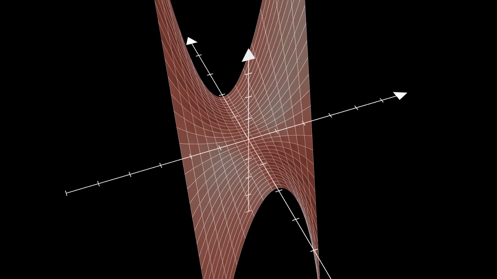

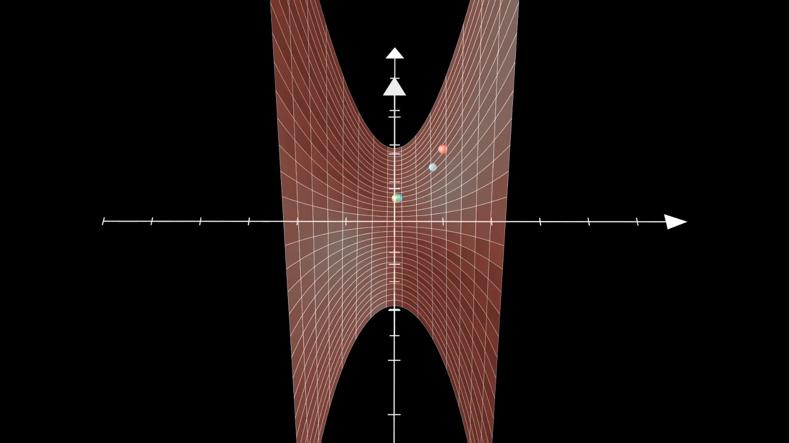

En color rojo, el punto inicial, especificado en los datos de entrada. En color azul, los puntos intermedios obtenidos, y finalmente en verde(parcialmente obstruido por otro punto azul en esta escena), el punto óptimo computado para la función, dadas las restricciones especificadas.

### Penalización

A continuación mostramos un ejemplo predeterminado para el problema de Penalización. De esta forma se puede apreciar la forma en que se llenan las casillas de los parámetros necesarios para ejecutarlo.

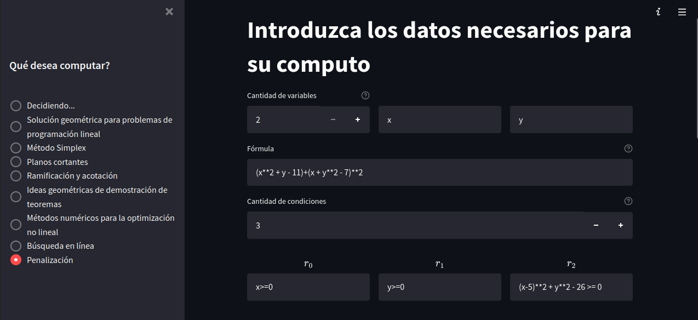

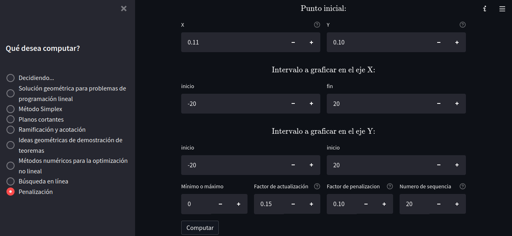

Esta sería la configuración del **penalty_settings.json** la cual consiste en 2 objetos, el primer string corresponde a la función objetivo y el segundo es una lista con las restricciones descritas a través de strings. Los otros parámetros son más específicos del método de penalización, la cantidad de iteraciones como caso de parada, el coeficiente de penalización, el valor para aumentar este, los rangos de x y las y. Los valores del mismo se llenan a través de la aplicación antes de ejecutar este algoritmo.


Esta sería la configuración del **geometric_aproach.json** la cual consiste en 2 objetos, el primer string corresponde a la función objetivo y el segundo es una lista con las restricciones descritas a través de strings. Los valores del mismo se llenan a través de la aplicación antes de ejecutar este algoritmo al igual que el anterior.


A continuación tenemos ejemplos de lo realizado.


Aquí podemos observar cómo sería el resultado de graficar una función con esta herramienta en 3d.


